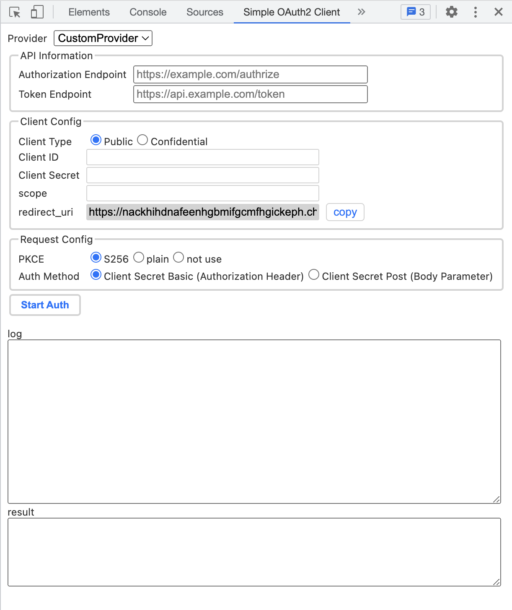

# Simple OAuth2 Client Chrome Extension

A simple OAuth2 client chrome extension that allows you to get the access token easily in development usecase.

This extension covers whole of authorization code flow.
Build authorization url, redirect and get the authorization code and exchange it for access token.

## Motivation

In many platforms, a OAuth2 access token is required to call APIs. But it is troublesome to get the access token manually.
For example, we need prepare correct authorize url using client id, redirect url, scope, state, etc. But also code verifier for PKCE flow recently.
And we need a HTTPS server to receive the authorization code. (Hi, facebook! why don't you allow using localhost to get auth code?)
I believe no one loves the hell of copy and paste auth code.

So I made this.

## Supported Features

- Public and confidential client
- PKCE(S256 and plain) and non-PKCE
- Authorization Header and Body Parameter for token request authorization

## Installation

- [Download](https://github.com/satetsu888/simple-oauth2-client-extension/archive/refs/heads/main.zip) zip file
- Extract it
- Open chrome extension management page ( chrome://extensions/ )
- Enable developer mode
- Click load unpacked extension
- Select the extracted directory

## Usage

- Open developer tools
- Click the Simple OAuth2 Client tab
- Fill each config sections
- Copy "redirect_uri" from Client Config section and paste it to "Redirect URIs" in your OAuth2 app setting page
- Click "Start Auth" button
